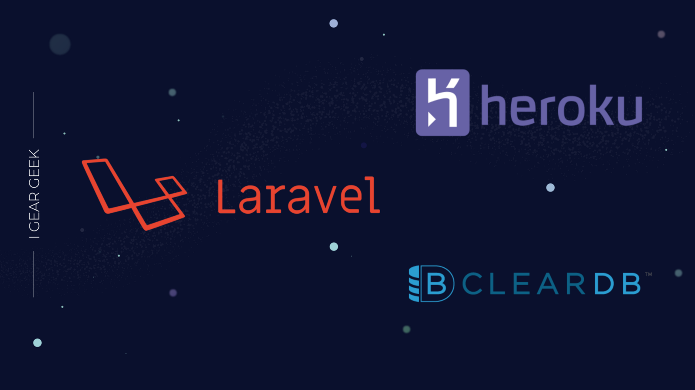

สิ่งที่จะได้จากบทความนี้ คือ เว็บแอปพลิเคชันที่พัฒนาด้วย Laravel มีฐานข้อมูล MySQL โดยใช้ ClearDB และ Deploy เว็บแอปพลิเคชันนี้ขึ้นบน Heroku

---

### Heroku คืออะไร ?

[Heroku](https://www.heroku.com/) คือ บริการคลาวด์แบบ PaaS (Platform as Service) ที่ใช้ทำเว็บแอปพลิเคชั่น สามารถ deploy เว็บได้แบบง่าย ๆ สำหรับเวอร์ชันฟรีสามารถใช้ได้สูงสุด 5 แอปพลิเคชันเท่านั้น

### ClearDB คืออะไร ?

[ClearDB](https://elements.heroku.com/addons/cleardb) คือ MySQL บนคลาวด์ ซึ่งเป็น add-on ของ heroku สำหรับเวอร์ชันฟรีมีขนาดฐานข้อมูล 5 MB แต่ก็เพียงพอสำหรับทดลองทำโปรเจคเล็ก ๆ

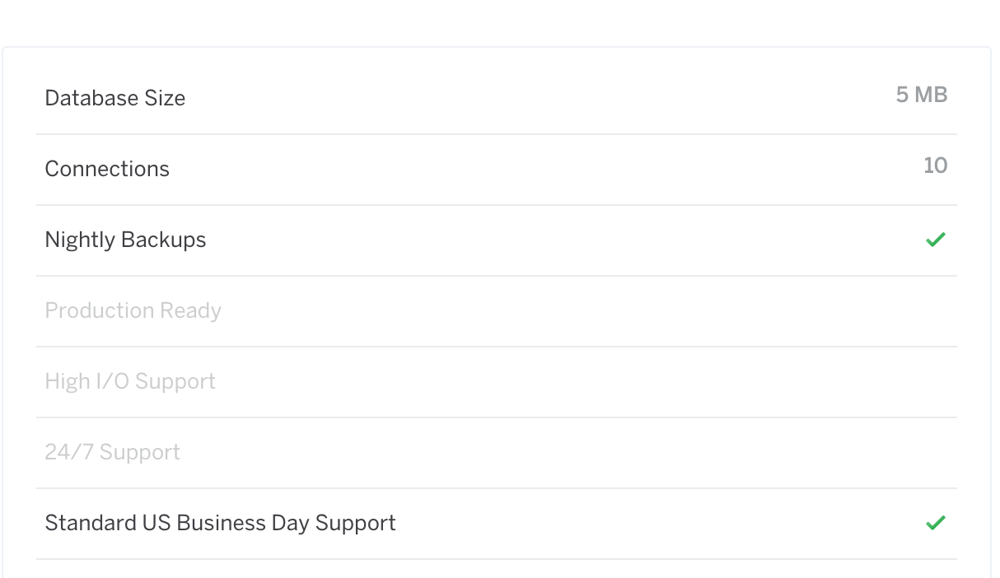

---

#### สิ่งที่ต้องมีในเครื่อง

-   [**Composer**](https://getcomposer.org/)  _ใช้สำหรับลง Package ของ php_
-   **Code editor** เช่น [Visual Studio Code](https://code.visualstudio.com)
-   [**MySQL Workbench**](https://www.mysql.com/products/workbench)  _ใช้ทดสอบการเชื่อมต่อกับฐานข้อมูล MySQL และใช้ตรวจสอบว่ามี Table นี้จริงตามที่ migration จาก laravel_

---

### Step 1: Setup Laravel

[**มาลองใช้ Vue.js บน Laravel 5.8 กันเถอะ**  
_เกริ่นนำก่อนเลยนะครับ บริษัท I GEAR GEEK มีโปรเจคใหม่เข้ามา และต้องการทำเว็บแอปแบบ SPA (Single Page Application)…_medium.com](https://medium.com/i-gear-geek/%E0%B8%A1%E0%B8%B2%E0%B8%A5%E0%B8%AD%E0%B8%87%E0%B9%83%E0%B8%8A%E0%B9%89-vue-js-%E0%B8%9A%E0%B8%99-laravel-5-8-%E0%B8%81%E0%B8%B1%E0%B8%99%E0%B9%80%E0%B8%96%E0%B8%AD%E0%B8%B0-59628c1da1ac "https://medium.com/i-gear-geek/%E0%B8%A1%E0%B8%B2%E0%B8%A5%E0%B8%AD%E0%B8%87%E0%B9%83%E0%B8%8A%E0%B9%89-vue-js-%E0%B8%9A%E0%B8%99-laravel-5-8-%E0%B8%81%E0%B8%B1%E0%B8%99%E0%B9%80%E0%B8%96%E0%B8%AD%E0%B8%B0-59628c1da1ac")[](https://medium.com/i-gear-geek/%E0%B8%A1%E0%B8%B2%E0%B8%A5%E0%B8%AD%E0%B8%87%E0%B9%83%E0%B8%8A%E0%B9%89-vue-js-%E0%B8%9A%E0%B8%99-laravel-5-8-%E0%B8%81%E0%B8%B1%E0%B8%99%E0%B9%80%E0%B8%96%E0%B8%AD%E0%B8%B0-59628c1da1ac)

_ติดตั้ง laravel ลงเครื่อง ส่วนใครที่มีโปรเจค laravel อยู่แล้ว ก็ใช้ของเดิมได้เลย_

### Step 2: Login to heroku

_เข้าไปที่_ [_https://id.heroku.com/login_](https://id.heroku.com/login)

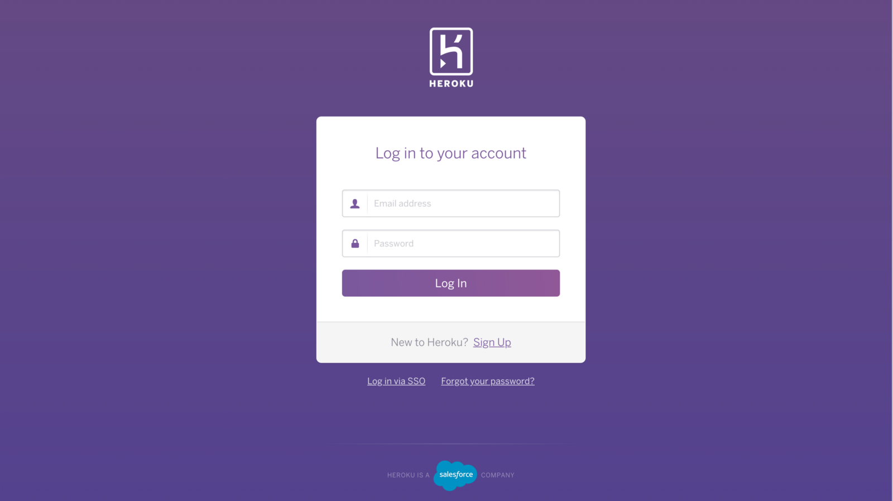

_จากนั้น ทำการกรอก_ **_email_** _และ_ **_password_** _เพื่อ Log In ส่วนใครที่ยังไม่เคยสมัคร heroku ก็กด_ **_Sign Up_** _เพื่อสมัครสมาชิกได้เลย_

### Step 3: Create heroku app

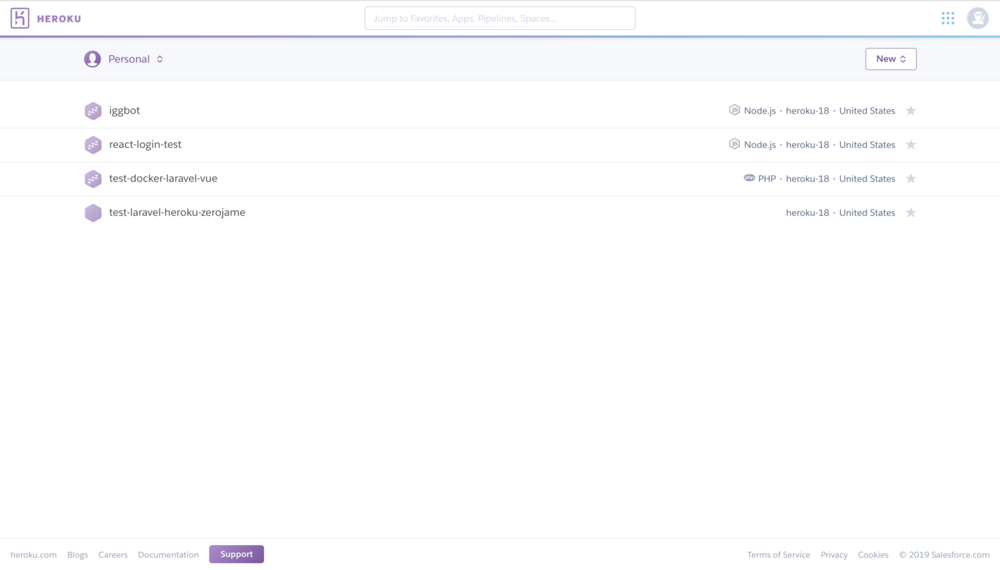

_เมื่อเข้าสู่ระบบแล้วจะเจอหน้านี้ กดปุ่ม_ **_new_** _ด้านขวาบน_

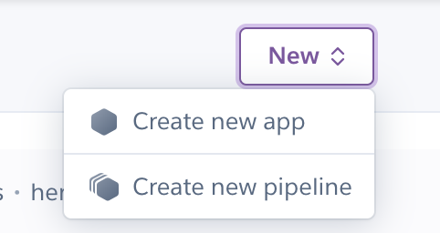

**_กด Create new App_**

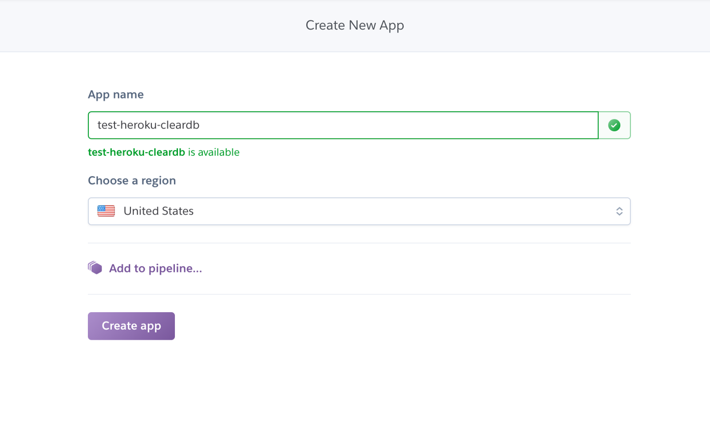

**_กรอก App name และให้มีเช็คถูก เพราะชื่อไม่สามารถซ้ำกันได้ จากนั้นกดปุ่ม create app ได้เลย_**

### Step 4: Add ClearDB add-on

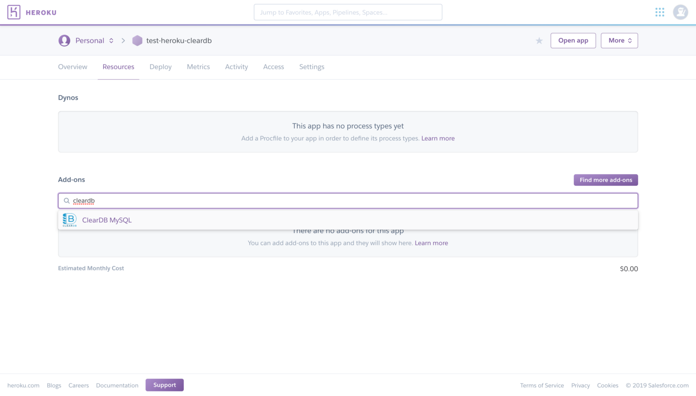

เข้าไปที่ tab **Resources** จากนั้นกรอก **cleardb** เพื่อค้นหา add-ons จะเจอ **ClearDB MySQL** แล้วกดคลิก

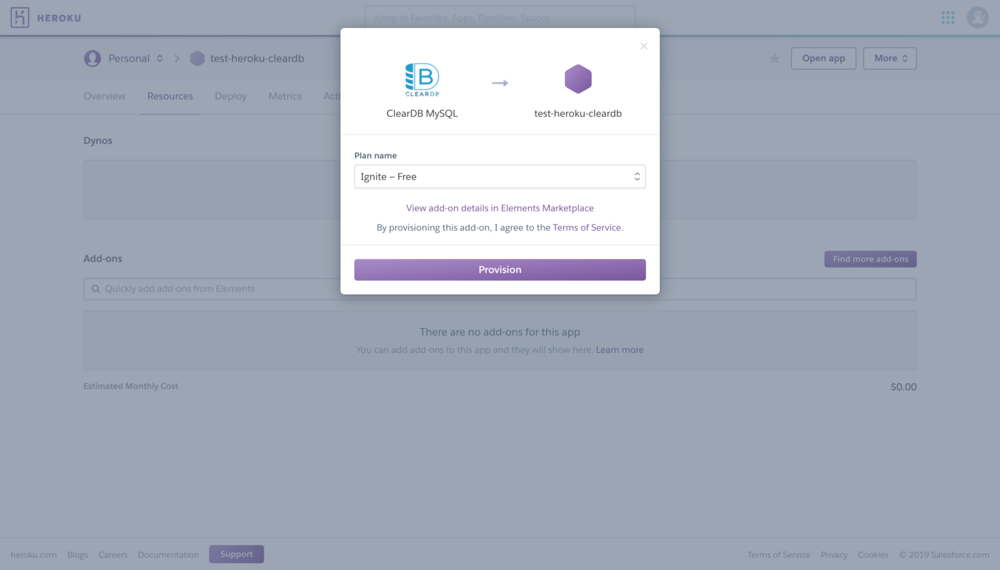

ตรงนี้ Plan ใช้แบบ Free อยู่แล้ว กด **Provision** ได้เลย

### Step 5: ClearDB Connect to MySQL Workbench

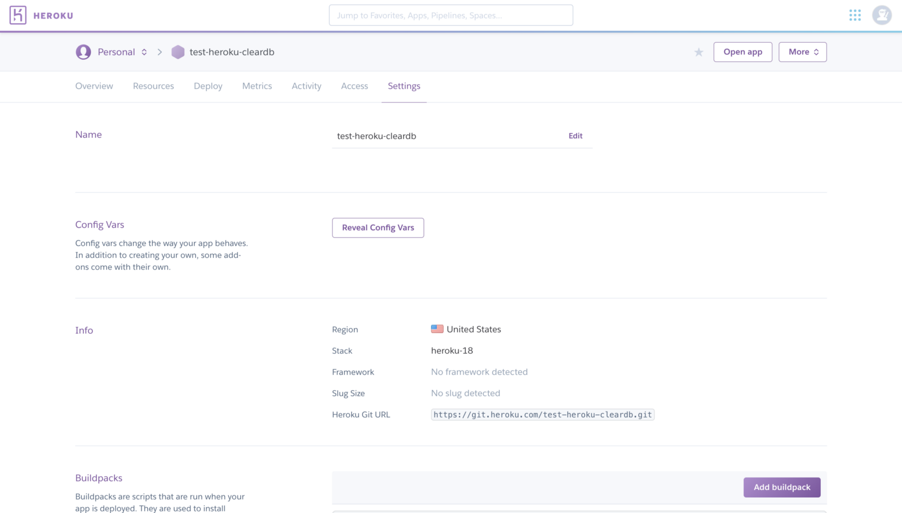

เข้าไปที่ tab **Settings** แล้วกดไปที่ปุ่ม **Revel Config Vars**

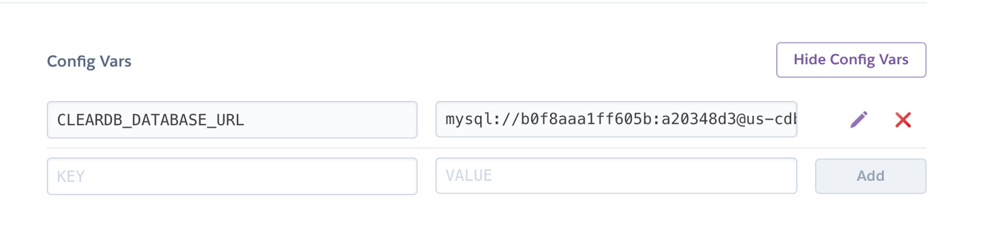

จะได้ค่า _config_ ของ **cleardb** ตามด้านล่างนี้

```
mysql://{Username}:{Password}@{Hostname}/{Database}?reconnect=true
```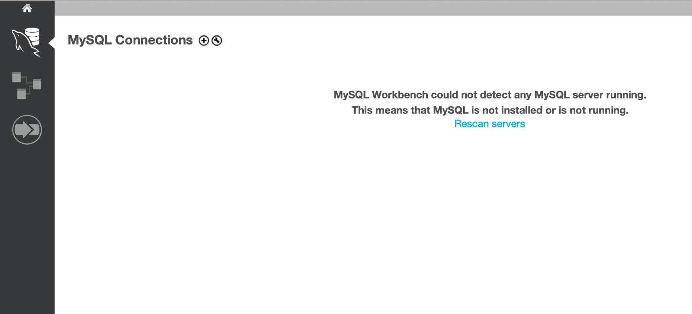

ทำการเปิดโปรแกรม **MySQL Workbench** จากนั้นกดปุ่ม **บวก** เพื่อสร้าง Connection

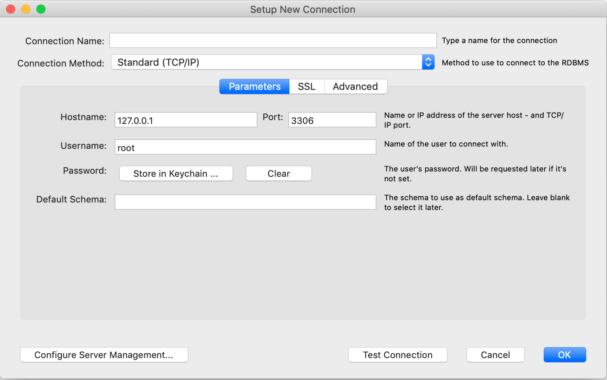

กรอก **Connection Name** (ชื่ออะไรก็ได้) กรอก **Hostname** และ **Username** ที่ได้จากค่า _config_ ของ **cleardb** และกดปุ่ม **Store in Keychain …** แล้วจะมี dialog ให้กรอก password จากนั้นกรอก password จากค่า _config_ ของ **cleardb**

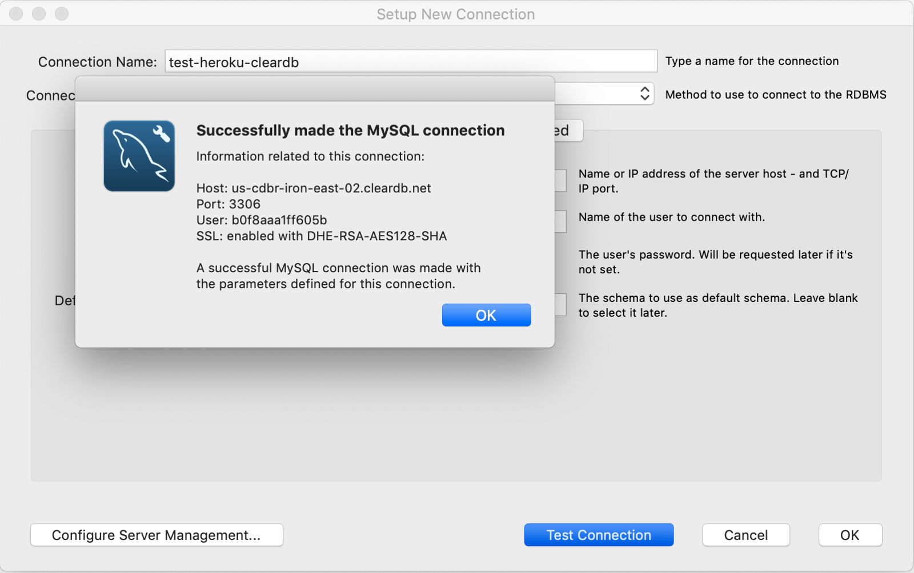

กดปุ่ม **Test Connection** จากนั้น จะขึ้นข้อความ _Successfully made the MySQL connection_ แสดงว่าสามารถเชื่อมต่อ MySQL ได้

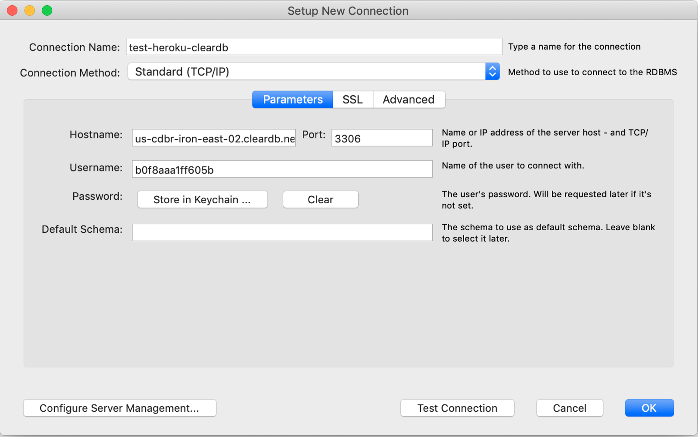

กดปุ่ม **OK**

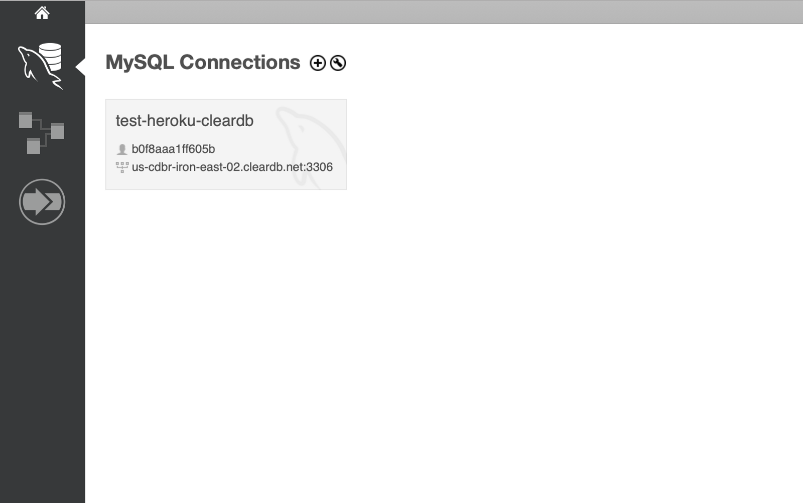

เข้าไปที่ **connection** ที่เพิ่งสร้าง

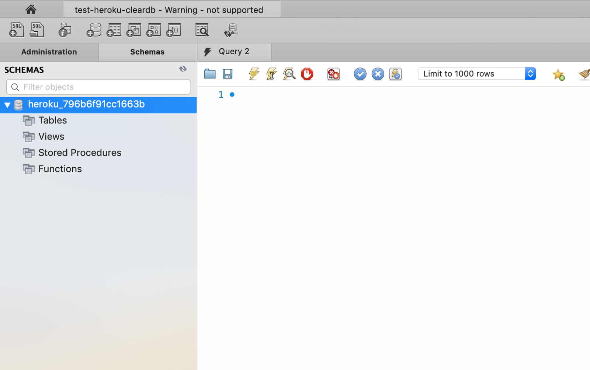

จะเจอฐานข้อมูลที่ชื่อตาม _config_ ของ **cleardb**

### Step 6: ClearDB connect to Laravel

_จาก_ **_Step 5_** _คักลอกค่า config ที่ได้จาก_ **_clearDB_** _ไปใส่ในไฟล์ .env_

```
DB_HOST=YOUR_DB_HOST
DB_DATABASE=YOUR_DATABASE
DB_USERNAME=YOUR_DB_USERNAME
DB_PASSWORD=YOUR_DB_PASSWORD
```

### Step 7: Migrate database

_เปิด Terminal ที่โปรเจค_ **_Laravel_** _แล้วพิมพ์คำสั่งตามด้านล่างเพื่อ_ **_migrate database_**

```
php artisan migrate:fresh
```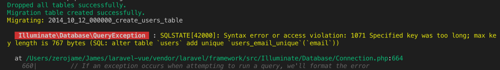

_สำหรับใครที่เจอ error แบบนี้ เนื่องจาก mysql เป็น version_ 5.5.56 ซึ่งเป็น version เก่า _วิธีแก้ปัญหา คือ_

_เข้าไปที่ไฟล์_ **_App\\Providers\\AppServiceProvider.php_** _จากนั้น แก้ไขโค้ดตามด้านล่าง_

```
use Illuminate\Support\Facades\Schema;  

public function boot() 
{     
     Schema::defaultStringLength(191); 
}
```

_จากนั้นพิมพ์คำสั่ง_ `_php artisan migrate:fresh_`_อีกครั้ง_

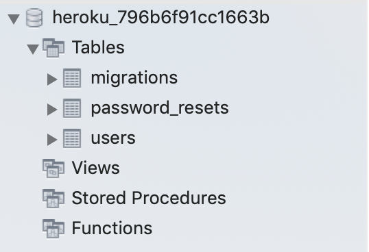

ในฐานข้อมูลของเราก็จะมี Table ตามที่ Migration

### Step 8: Seed database

_พิมพ์คำสั่งตามด้านล่างเพื่อสร้าง_ **_seed database_**

```
php artisan make:seeder UsersTableSeeder
```

_เข้าไปที่ไฟล์_ **_database\\seeds\\UsersTableSeeder.php_** _จากนั้น แก้ไขโค้ดตามด้านล่าง_

```
use App\User;

public function run() 
{     
     User::create([
          'name' => 'test',
          'email' => 'test@test.com',
          'password' => '1234567890'
     ]);

} 
```

_เข้าไปที่ไฟล์_ **_database\\seeds\\DatabaseSeeder.php_** _จากนั้น แก้ไขโค้ดตามด้านล่าง_

```
public function run() 
{     
     $this->call(UsersTableSeeder::class);

}
```

_พิมพ์คำสั่งตามด้านล่างเพื่อ_ **_seed database_**

```
composer dump-autoload

php artisan db:seed
```

### Step 9: Create API

_พิมพ์คำสั่งตามด้านล่างเพื่อสร้าง_ **_controller_**

```
php artisan make:controller API/UserController --api
```

_เข้าไปที่ไฟล์_ **_app\\Http\\Controllers\\API\\UserController.php_** _จากนั้น แก้ไขโค้ดตามด้านล่าง_

```
use App\User;

public function index() 
{
     return User::get();     

}
```

_เข้าไปที่ไฟล์_ **_routes\\api.php_** _จากนั้น เพิ่มโค้ดตามด้านล่าง_

```
Route::get('users', 'API\Controller@index');
```

### Step 10: Run Laravel

_พิมพ์คำสั่งตามด้านล่างเพื่อ_ **_run laravel_**

```
php artisan serve 
```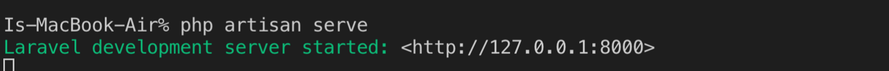

_เข้าไปที่_ **_127.0.0.1:8000/api/users_**

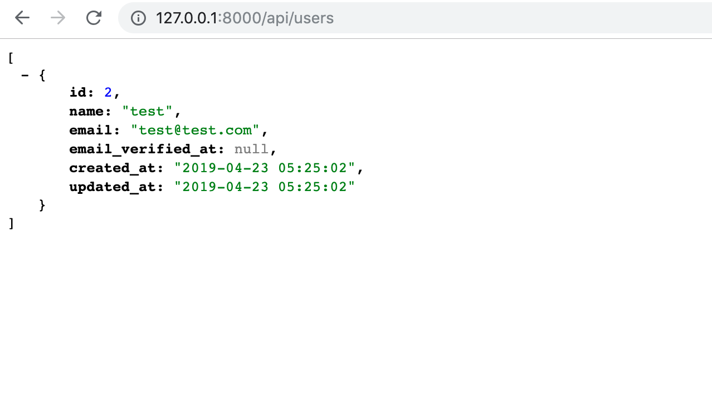

จะได้ API รายชื่อ users

### Step 11: Deploy Laravel to Heroku

_เข้าไปที่ไฟล์ _**_.gitignore_** _แล้วลบ หรือ comment .env เพื่อให้ deploy .env เนื่องจากค่า config db อยู่ในไฟล์ .env ต้องเอา .env deploy ขึ้นไปด้วย_

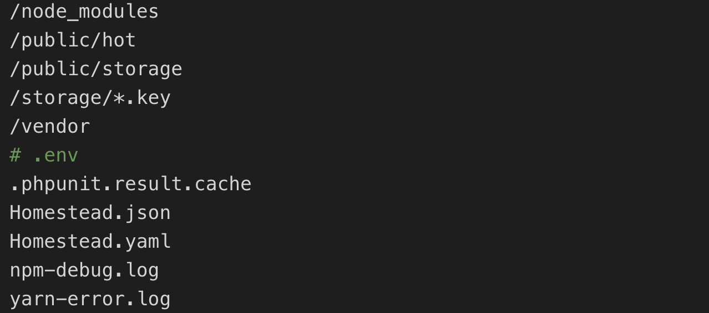

_เพื่อให้ apache รันที่ public/ ด้วยคำสั่งด้านล่างนี้_

```
echo "web: vendor/bin/heroku-php-apache2 public/" > Procfile
```

_ในการ deploy heroku จำเป็นต้องมี Heroku CLI สำหรับใครที่ยังไม่มีสามารถดาวน์โหลดได้ที่ลิ้งด้านล่าง_

[**The Heroku CLI | Heroku Dev Center**  
_How to download, install, and start using, the Heroku CLI. The Heroku CLI used to be part of the Heroku Toolbelt._devcenter.heroku.com](https://devcenter.heroku.com/articles/heroku-cli "https://devcenter.heroku.com/articles/heroku-cli")[](https://devcenter.heroku.com/articles/heroku-cli)

_ทำการเข้าสู่ระบบ heroku_

```
heroku login
```

_สร้างและ remote git_

```
git init
heroku git:remote -a test-heroku-cleardb
```

_add ไฟล์ทั้งหมด, commit message, และ push ผ่าน heroku_

```
git add .
git commit -am "make it better"
git push heroku master
```

_ทำการเปิดแอพ heroku_

```
heroku open
```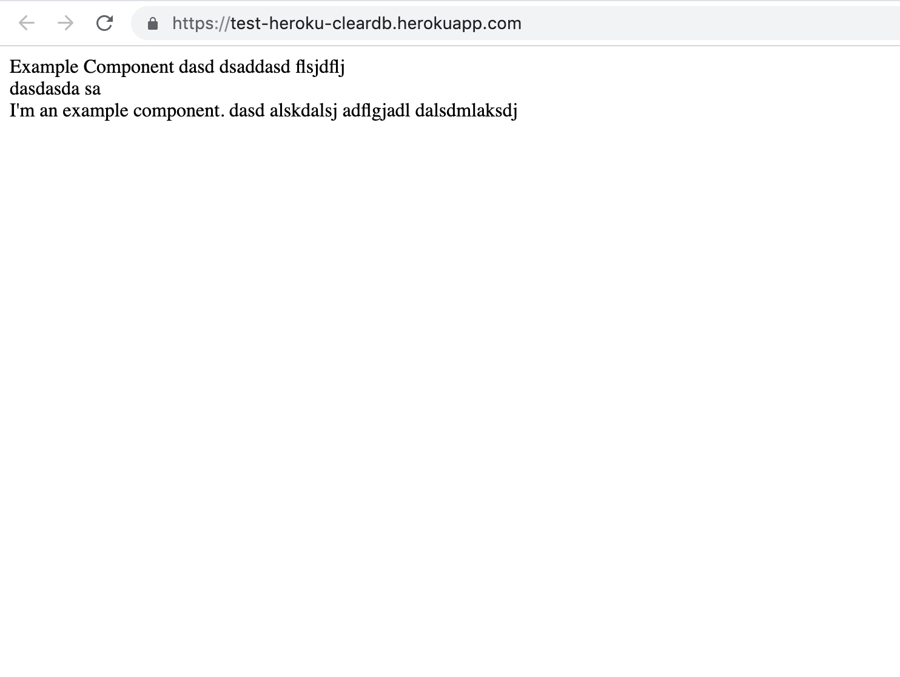

_จะได้แอพ heroku ของเราที่สร้างไว้ จากนั้น เข้าไปที่ path /api/users_

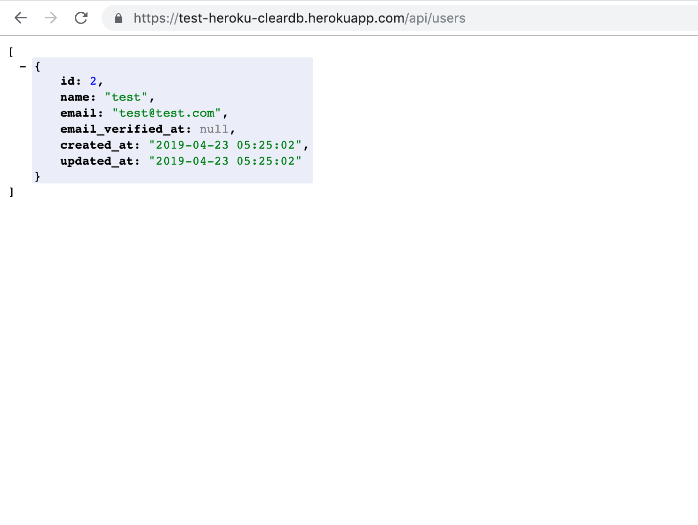

เรียบร้อย แค่นี้ก็ได้ api แบบง่าย ๆ ที่ deploy ผ่าน heroku และใช้ cleardb ที่ใช้ add-on ของ heroku

### จุดสังเกต

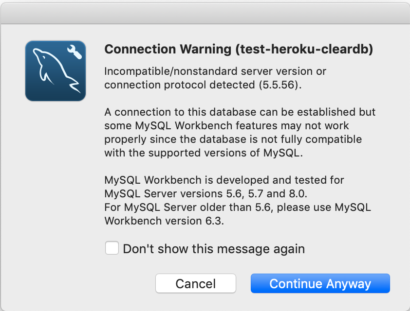

สำหรับ MySQL Workbench version ปัจจุบัน (8.0.15) ถ้าเชื่อมต่อกับ ClearDB บาง feature ไม่สามารถใช้งานได้ ต้องใช้ MySQL Workbench version 6.3 ถึงจะใช้งานfeatureทั้งหมดได้

### สรุป

ฐานข้อมูลของ ClearDB ที่มีขนาด 5 MB และการ Deploy เว็บขึ้น Heroku ก็เพียงพอ ที่จะทำเว็บแอปพลิเคชันเล็ก ๆ เป็นของตัวเองได้ นอกจาก ClearDB แล้ว Heroku ยังมี [**Heroku Postgres**](https://www.heroku.com/postgres)  ใครอยากลองเล่นก็ไปศึกษาเพิ่มเติมได้เลยครับ
