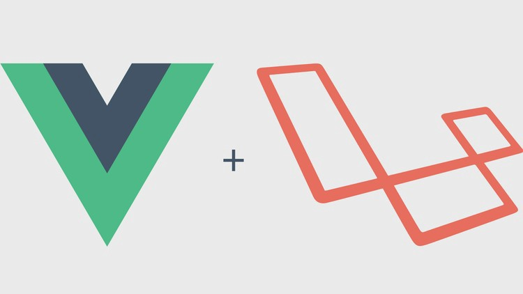
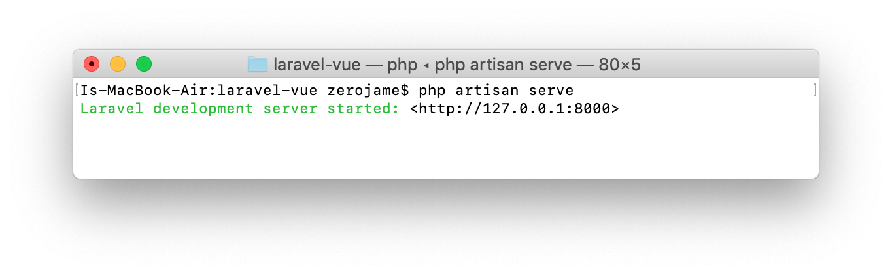
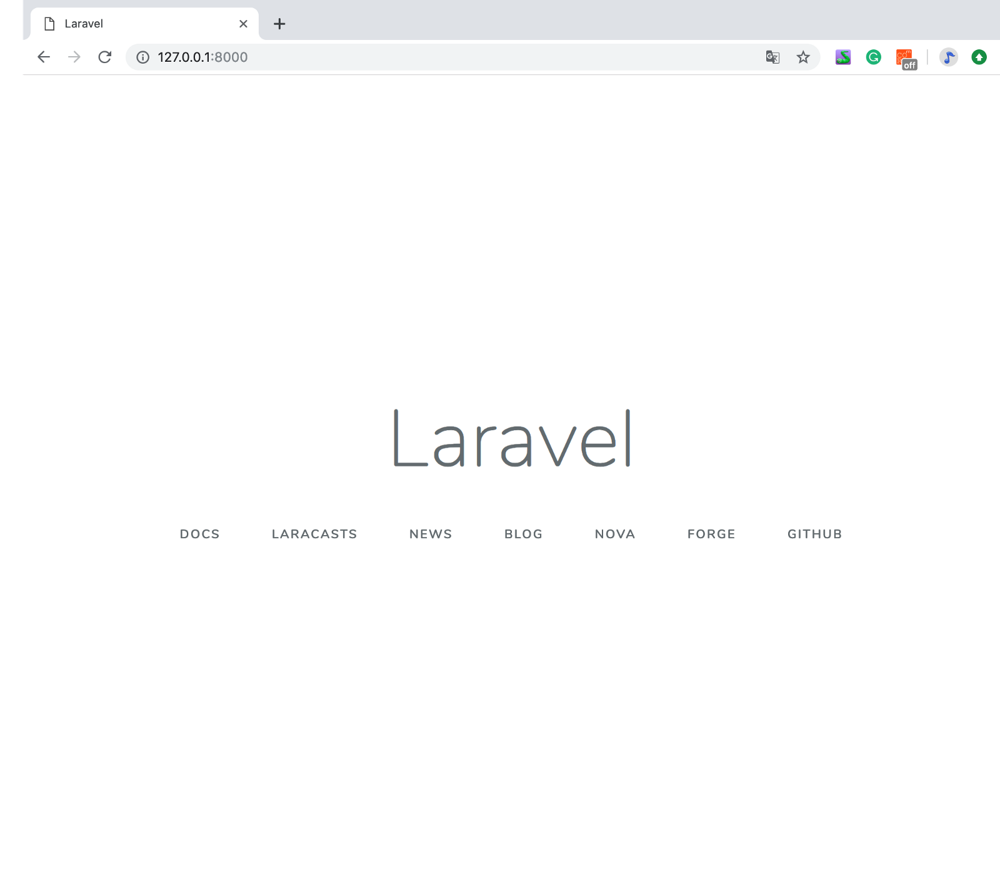
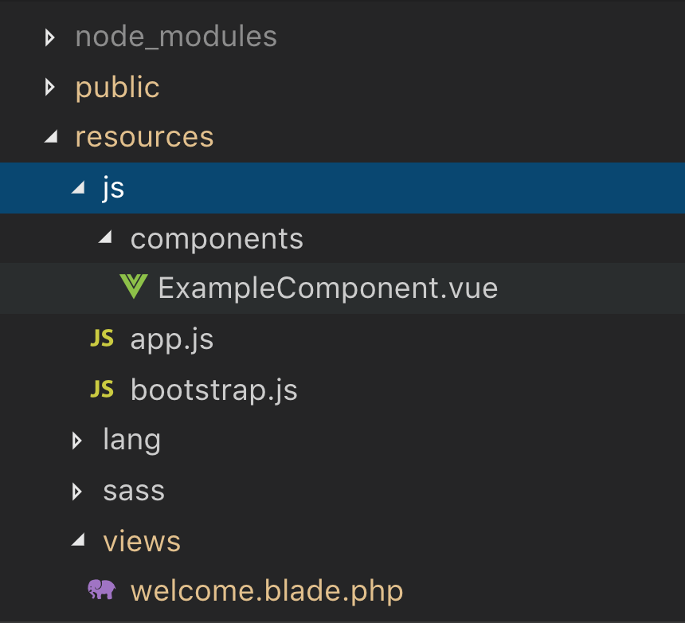
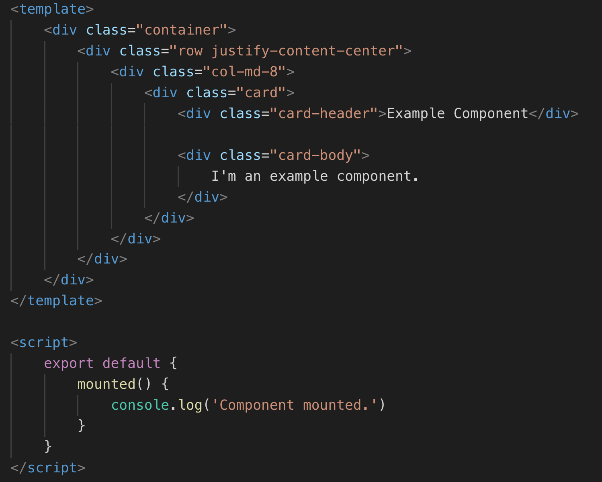
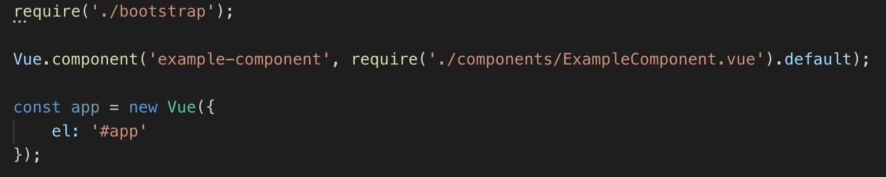
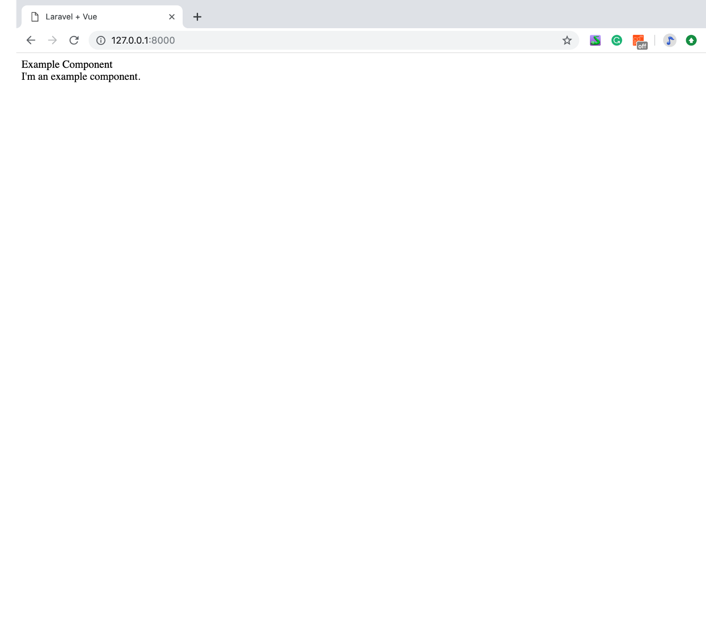

เกริ่นนำก่อนเลยนะครับ _บริษัท_  [**_I GEAR GEEK_**](https://www.facebook.com/igeargeek/)  มีโปรเจคใหม่เข้ามา และต้องการทำเว็บแอปแบบ SPA (Single Page Application) ถ้าอธิบายแบบเข้าใจง่ายนั่นก็คือ เว็บแบบไม่ต้องโหลดหน้าใหม่ ซึ่ง Laravel เป็นตัวเลือกที่เหมาะสม เนื่องจาก Backend ใช้เป็น Laravel และ Laravel ก็มี Vue.js ติดตั้งมาให้ เพียงแค่ต้องไปตั้งค่านิดหน่อย สำหรับวันนี้ผมจะมาอธิบายวิธีการติดตั้ง Laravel ร่วมกันกับ Vue.js

---

#### **สิ่งที่ควรรู้**

-   พื้นฐานภาษา php
-   พื้นฐานภาษา javascript
-   พื้นฐาน git version control

#### **สิ่งที่ต้องมีในเครื่อง**

-   [**Composer**](https://getcomposer.org/)  _ใช้สำหรับลง Package ของ php_
-   [**Node.js**](https://nodejs.org)  _ใน Node.js จะ npm ใช้สำหรับลง Package เหมือนกับ composer แต่เป็น package ของ javascript_
-   **Code editor** เช่น [Visual Studio Code](https://code.visualstudio.com)

---

### **Step 1: Intial Laravel**

_clone โปรเจคจาก github ของ_ [_laravel_](https://github.com/laravel/laravel)

```
git clone https://github.com/laravel/laravel.git laravel-vue
```

### **Step 2: Setup laravel**

_เข้าไปที่ directory ชื่อ laravel-vue_

```
cd laravel-vue
```

_ทำการ install dependency composer_

```
composer install
```

_ทำการ สร้างไฟล์ .env แล้วคัดลอกจาก .env.example_

```
cp .env.example .env
```

_ทำการ generate key APP\_KEY_

```
php artisan key:generate
```

### Step 3: Run laravel

_ทำการ run laravel_

```
php artisan serve
```

_รันคำสั่งแล้วจะเจอแบบนี้ จากนั้น เข้าเว็บ 127.0.0.1:8000 ใน browser_



_ถ้าเจอหน้านี้แสดงว่า laravel ใช้งานได้_ **_มาต่อกันที่ Vue.js กัน_**

### Step 4: Setup Vue.js

_ทำการ install dependency package_

```
npm install
```

**Vue.js** ใน **laravel** ส่วนที่สำคัญ คือ folder **/resources/js** ประกอบไปด้วย

-   **/components** คือ  folder ที่รวม component ต่าง ๆ
-   **app.js** คือ ไฟล์ที่ใช้งาน component, router หรือ library ต่าง ๆ
-   **bootstrap.js** คือ  ไฟล์สำหรับการ import ต่าง ๆ



ใน _component_ หลัก ๆ จะมีสองส่วน ส่วนแรก **_template_** ก็คือ html เลย และส่วนที่สอง คือ **_script_** ใช้กำหนดตัวแปร และสร้างฟังก์ชันต่าง ๆ



จากรูปด้านบน

-   **vue.component()** เป็นการกำหนด **component** จากภาพชื่อ ‘example-component’ เวลาเรียกใช้ใน **template** ก็จะเป็น _tag <example-component></example-component>_
-   **el** คือ การกำหนดให้ **Vue.js** แสดง **component** จากที่ไหน จากโค้ด el: ‘#app’ กำหนดให้แสดงภายใน id =”app”

ตัวอย่างไฟล์ที่เรียกใช้ Vue.js

จากโค้ดด้านบน ให้ทำการคัดลอกแล้วไปทับที่ path

```
/resources/views/welcome.blade.php 
```

**_tag <div>_** _ทำการกำหนด id=”app” เพื่อแสดงข้อมูล ภายใน_ **_tag <div>_** _กำหนด component ที่ใช้แสดง จากนั้นใส่ script ด้านล่าง_

### Step 5: Run Vue.js

_ทำการ run vue.js_

`npm run dev`



เพียงเท่านี้ก็สามารถใช้ vue.js ได้แล้วครับ

### **สรุป**

จะเห็นได้ว่า Vue.js จะอยู่ในตัวของ Laravel เลย ไม่จำเป็นต้องสร้างโปรเจคแยก ส่วน port ก็ใช้ port เดียวกันด้วย ทำให้สร้าง app กับ api ไม่ต้องแยก port เหมาะสำหรับโปรเจคที่ใช้ Laravel อยู่แล้วและอยากได้เว็บแอปแบบ SPA ครับ สำหรับบทความครั้งต่อไปก็จะเป็น Laravel + Vue.js เหมือนเดิมครับ อาจจะเป็น Vue-Router หรือ Vue-Bootstrap ครับ
